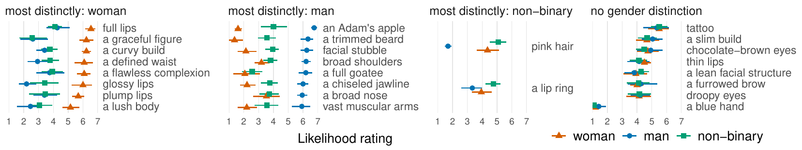
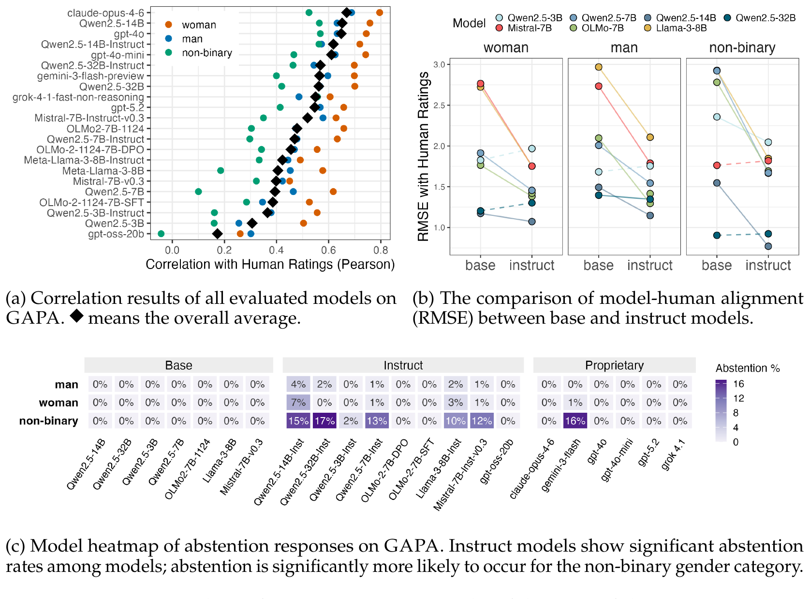
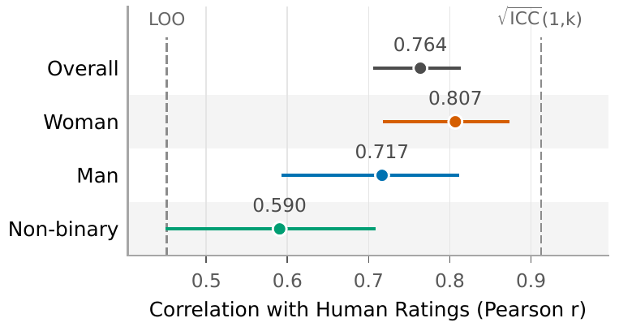

# GAPA: Gender Associations of Physical Attributes

[](https://arxiv.org/abs/2609.16366)
[](https://huggingface.co/datasets/alisa-yingjia-wan/gapa)
[](https://huggingface.co/alisa-yingjia-wan/gapa-predictor-olmo2-7b)
[](LICENSE)

Code for **[How Humans and LLMs Read Gender into "Gender-Neutral" Physical Descriptions](https://arxiv.org/abs/2609.16366)** (COLM 2026). Data and model are released on [🤗 HuggingFace](https://huggingface.co/collections/alisa-yingjia-wan/gapa).

Growing work in AI fairness, accessibility, and ethics recommends describing a person through observable physical attributes ("short hair", "a defined jawline"), rather than an inferred identity label ("he", "she"). The reasoning is that describing what is visible avoids imposing unverifiable identity claims. This project asks whether that language is actually gender-neutral, and finds that it is not: physical descriptions carry systematic, graded gender associations for human readers and language models alike.


<sub>Paper Figure 1 — an excerpt of the most gender-distinctive attributes in each ranking pattern, with their per-gender association ratings.</sub>

---

## Repository structure

```
GAPA/
├── gapa/                  Resolve paths and store helper functions.
├── data/                  Fetch script to download and build GAPA data.
├── human_analysis/        Human gender associations.
│   └── noise_ceiling/        LOO and ICC(1,k) human reliability ceilings.
├── llm_analysis/          Zero-shot evaluation of LLMs.
├── training/              LoRA training (shared scripts at the top level).
│   ├── hp_search/            configs for training base model with hyperparameter search.
│   └── predictor/            config for training the final GAPA predictor (and saved run).
├── novel_extractor/       LLM extraction of attributes from novels.
├── litbank_analysis/      The predictor applied to LitBank at scale.
├── prompts/               Prompt templates (our paper uses direct.txt).
├── config.json            Default training hyperparameters.
└── experiments.json       Default search grid.
```

| Section | Paper | What it does |
|-------|------|---|
| [Quick start](#quick-start) | §3–4 | Install, and download data from the GAPA dataset.|
| [Human analysis](#human-analysis) | §4 | *Analysis on the GAPA dataset*: Humans make consistent gendered associations on physical attributes, yet with high noise due to task subjectivity. |
| [LLM evaluation](#llm-evaluation) | §5 | *Zero-shot evaluation on 22 LLMs*: LLMs map humans' gendered associations with patterned misalignments and abstention against describing non-binary people. |
| [Training the predictor](#training-the-predictor) | §6.1 | The full LoRA stack to train the GAPA predictor model and training results. |
| [Attribute extraction](#attribute-extraction) | §3 | Automated pipeline to extract physical-attribute descriptions from any documents, with annotation to verify its quality. |
| [Scaled novel analysis](#scaled-novel-analysis) | §6.2 | The GAPA predictor model applied across LitBank to perform socio-linguistic analysis.|

<!-- `config.json`, `experiments.json` and `prompts/` sit at the repo root rather than inside `training/` because `llm_analysis/` and `litbank_analysis/` read them too.  -->

<!-- This code repository contains the code and results for training, evaluation, and analysis, while the trained predictor and dataset are distributed through Hugging Face. -->

---

## Quick start

Install the package and download the [GAPA dataset](https://huggingface.co/datasets/alisa-yingjia-wan/gapa) from HuggingFace.

```bash
pip install -e .                   # every script resolves repository paths through `gapa.paths`
pip install -r requirements.txt    # install packages
cp .env.example .env               # only needed for API models and HF-gated weights
python data/download_ratings.py    # fetch the ratings
```

That writes eight tables, pinned to the dataset revision the paper used:

| File | Contents |
|---|---|
| `merged.csv` | Every rating row from all three attribute sources, unfiltered |
| `merged_clean.csv` | The canonical rating table, after cleaning |
| `llm{,_clean}.csv` | The LLM-generated attribute subset |
| `human{,_clean}.csv` | The human-written subset, held out for evaluation |
| `novel{,_clean}.csv` | The novel-extracted subset, held out for evaluation |

Every attribute is rated against all three genders by multiple annotators on a 7-point scale, measuring how likely someone would be to say that a *woman*, a *man*, or a *non-binary person* has that attribute. This makes the gender comparisons possible.

`--config clean` fetches only the canonical tables, `--source human` only one attribute source, and `--verify` checks what is already on disk. The [dataset card](https://huggingface.co/datasets/alisa-yingjia-wan/gapa) documents the cleaning rules, and information about the three attribute sources. Also check the paper for full details.


---

## Human analysis

<!-- Participant identifiers are pseudonyms (`P001`–`P304`) rather than Prolific IDs, and the table linking them back is not distributed. See `data/deidentify_participants.py` for exactly how the pseudonyms were assigned and which columns were dropped. -->

<!-- The ratings show that people do make consistent gendered associations on physical attributes; that result is reported in the paper. (in R code pending uploading) -->

Because the rating task is **genuinely subjective**, it is important to know how consistently people agree with each other. **This agreement also bounds how well any model could possibly do.** 

The following command reports two complementary measures: leave-one-rater-out correlation (LOO) (`noise_ceiling_LOO.py`) and ICC(1,k) (`noise_ceiling_ICC.py`) for each gender category. LOO captures how closely a typical individual rater tracks the consensus of
the others. ICC(1,k) describes the reliability of the *aggregated* ratings — how much noise survives after averaging across raters. The first speaks to individual agreement, the second to the quality of the training signal. Check the paper for full details.

```bash
python human_analysis/noise_ceiling/summary.py
```

The summary script writes `noise_ceiling_summary_overall.csv` and `noise_ceiling_summary_per_gender.csv`. They are required in `llm_analysis/` to draw the ceiling reference lines for the analysis for LLM evaluation.

<!-- The rest of §4 — the mixed-effects models and the per-attribute ranking-pattern classification — was written in R and has not been migrated. The underlying ratings are all in `data/`, so those analyses can be redone from source. -->

---

## LLM evaluation

This stage gives language models the same rating task the human annotators received, then measures how closely their answers track the averaged human ratings using Pearson correlation and RMSE.

```bash
python llm_analysis/model_eval.py          # open-weight models, run locally
python llm_analysis/api_eval.py            # proprietary models, needs keys in .env
python llm_analysis/summarize_eval.py      # all tables and figures from stored results
```
<!-- 
This writes per-gender Pearson correlations and RMSE for every model to `llm_analysis/plots/summary_tables.txt`. -->

Because the outputs of all 22 evaluated models are committed under `llm_analysis/results/`, `summarize_eval.py` reproduces the analysis without re-running any inference. You are welcome to test on more models and include them in the analysis. It writes into `llm_analysis/plots/`:

- `summary_tables.txt` and `summary_person_term.csv` hold the headline alignment numbers — per-gender RMSE and Pearson r for every model.
- `comparison/` contains per-gender correlations by model, including how they sit against the human reliability ceilings.
- `base_instruct/` compares base models with their instruction-tuned counterparts.
- `abstention/` reports how often each model declined to answer, broken down by gender category.

The plotting code lives in the `llm_analysis/summarize/` package, and `--fig_format pdf` switches the output to vector graphics.

Paper Figure 6 — zero-shot inference results of the evaluated LLMs:



---

## Training the predictor

The predictor is an LLM backbone fine-tuned with LoRA, with a linear regression head over the mean-pooled final-layer representation trained on averaged human ratings under MSE loss. `training/` holds the recipe that produced the released model.

#### 1. Prepare data for training

The prompt-formatted splits that the predictor trains on are derived rather than stored, and `prep_data_for_training.py` rebuilds them deterministically:

```bash
python training/prep_data_for_training.py \
    --input data/merged_clean.csv \
    --output data/merged \
    --extract_type avg \
    --prompt_name direct \
    --seed 123 --val_size 0.0 --test_size 0.3
```

A single pass does three things.

1. First it **cleans** the input, writing `<input>_clean.csv` beside it, by dropping both attention-check attributes and any incompletely-rated attribute that is missing one of the three genders.
2. Then it **aggregates**: `--extract_type avg` averages the ratings for each attribute–gender pair and records their variance.
3. Finally it **formats and splits**, applying the template named by `--prompt_name` (e.g., `--prompt_name direct` to replicate the paper) and labels each attribute with a train/validation/test split.

Held-out evaluation sets take `--force_split_label test` instead. See `training/README.md`.

<!-- The shipped rating tables carry **no `split` column**: a split describes an experiment,
not the dataset, and the two training stages use different ones. Pass `--val_size`,
`--test_size` and `--seed` to say which you want — the released predictor used
`0.0` / `0.3` with seed 123, the hyperparameter search `0.15` / `0.25`. -->

<!-- Held-out evaluation sets take `--force_split_label test` instead, since every one of their rows is test. `training/README.md` lays out which stage uses which, and `training/verify_splits.py` checks a prepared directory for leakage and proportion drift. -->

#### 2. Run trainings

Two stages, separated in `training/` because they use different data and different splits: `hp_search/` searches hyperparameters on `llm` (60/15/25), and `predictor/` carries the winners onto `merged` (70/0/30), where the best run is the released predictor.

```bash
# 1. run the sweep — the first command is a dry run, --full actually trains
python training/run_experiments.py
python training/run_experiments.py --full --max-parallel 4

# 2. select the best runs, evaluate them, and report
python training/hp_search/select_best_runs.py --results-dir results_bestruns
python training/predictor/evaluate_best_runs.py --mode human
python training/predictor/report_stratified_eval.py --predictions <run>/eval_results/predictions.csv
```

The final step reports test-set Pearson r and RMSE stratified by gender category.


<sub>Paper Figure 7 — training results of the released predictor, evaluated on GAPA (test). Dashed lines mark the human reliability ceilings.</sub>
 Which configuration does what — and which one produced the released model — is documented in `training/README.md`; the hyperparameter grid and the ablation design are in `training/hp_search/ABLATIONS.md`.

Our trained GAPA predictor is published with instructions on [HuggingFace](https://huggingface.co/alisa-yingjia-wan/gapa-predictor-olmo2-7b) (test r = 0.764, RMSE = 0.633).

---

## Attribute extraction

We use an automated pipeline which extracted all physical description-based attributes from any document, to build the novel-sourced subset of GAPA, as well as to collect data for scaled novel analysis.


#### 1. Download Litbank for attribute extraction

We download the corpus from [dbamman/litbank](https://github.com/dbamman/litbank), released by Bamman, Popat & Shen (2019), *An annotated dataset of literary entities*, NAACL.

<!-- Full texts of in-copyright novels are never distributed; `novel_extractor/README.md` explains how to reconstruct them from your own copies. -->

```bash
# LitBank's 100 source novels are not vendored (~58 MB), so fetch them first if you
# intend to re-run extraction. The download is pinned to an upstream commit and
# checksum-verified.
python novel_extractor/download_litbank.py
```

#### 2. Run the automated attribute extractor

We use an LLM agent to extract physical-attribute descriptions from novels (or any document), and the results are then filtered and sampled down to a specified size.
Extraction produces one `*_physattr.csv` per novel, with a row for each attribute and the sentence it came from.


```bash
python novel_extractor/extract.py --input-dir novel_extractor/source --output-dir novel_extractor/extracted
python novel_extractor/analyze.py          # cross-novel summary tables
python novel_extractor/sample.py           # sample attributes for annotation
```
The pipeline runs on any directory of text. You can change the document from which to extract attributes by modifying `--input-dir`.


#### Extraction quality

We performed manual annotation to verify the quality of the automated extraction pipeline. See [`novel_extractor/README.md`](novel_extractor/README.md) for further details.


---

## Scaled novel analysis on LitBank

This is the demonstration of what the predictor makes possible. It is applied to the attributes extracted from LitBank's 100 novels, producing a three-dimensional gender-association profile for every attribute, which can then be analyzed against the gender of the character being described and the gender of the author describing them.


```bash
python litbank_analysis/prep_merge_data.py \
    --extracted-dir novel_extractor/extracted/litbank \
    -o litbank_analysis/litbank/merged_extracted.csv
python litbank_analysis/predict_ratings.py --backend hf --models <model>
```

The result is `merged_extracted_rated.csv`, in which every extracted attribute carries predicted association ratings for *woman*, *man*, and *non-binary person*, joined to the author and character gender metadata.

---

<!-- ## Scope

This repository holds the dataset, the evaluation pipeline, and the training code. It is
not a figure-reproduction harness; for the published figures in their exact form, see the
paper. Two things are worth knowing if you plan to build on the analysis:

- **The §4 human analyses are not included.** The mixed-effects models and ranking-pattern
  classification were written in R and never migrated. The underlying ratings are in
  `data/`, and the reliability ceilings under `human_analysis/noise_ceiling/` do run.
- **Derived data is not committed.** Training splits, model weights, and sweep results are
  all rebuilt from the rating tables using the commands above. Pass the split you want
  explicitly; see `training/README.md`.

--- -->

## Licence

The code in this repository is MIT licensed; see `LICENSE`.
The [GAPA predictor model](https://huggingface.co/alisa-yingjia-wan/gapa-predictor-olmo2-7b) is Apache-2.0, inherited from its base model [`allenai/OLMo-2-1124-7B`](https://huggingface.co/allenai/OLMo-2-1124-7B).
<!-- LitBank is CC BY 4.0.  -->


## Citation

```bibtex
@inproceedings{wan2026gapa,
  title         = {How Humans and LLMs Read Gender into ``Gender-Neutral'' Physical Descriptions},
  author        = {Wan, Yingjia and Lin, Lin L. and Kreiss, Elisa},
  booktitle     = {Conference on Language Modeling (COLM)},
  year          = {2026},
  eprint        = {2609.16366},
  archivePrefix = {arXiv},
  primaryClass  = {cs.CL},
  url           = {https://arxiv.org/abs/2609.16366}
}
```
